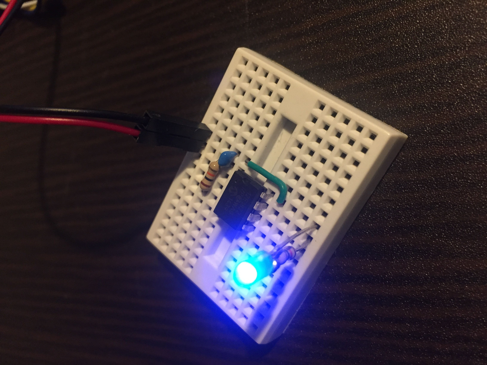

# pic-cui-build-linux
[](./LICENSE)

Linux上でCUIのみで, PICマイコンをBuild, WriteするMakefileを作成したので公開する.

- [Enviroment](#enviroment)
    - [Hardware](#hardware)
    - [Software](#software)
- [Files](#files)
- [Make Rule](#make-rule)
- [Demo Program](#demo-program)
- [Demo](#demo)
- [Trouble Shooting](#trouble-shooting)
- [LICENSE](#license)

## Enviroment
### Hardware
- Writer: [Pickit 3](https://www.microchip.com/Developmenttools/ProductDetails/PG164130)
- Target MCU: [PIC12F1822](https://www.microchip.com/wwwproducts/en/PIC12F1822)

### Software
- OS: [Ubuntu 18.04](https://www.ubuntu.com/)
- Build Tool: [MPLAB® X IDE v5.05 for Linux](http://www.microchip.com/mplab/mplab-x-ide)
- Compiler: [MPLAB® XC8 Compliler v2.00 for Linux](http://www.microchip.com/mplab/compilers)

~/.bashrcに以下を追記.

```
export PATH="$PATH:"/opt/microchip/xc8/v2.00/bin""
```

## Files
```bash
$ tree -f .
.
├── ./LICENSE
├── ./Makefile
├── ./README.md
├── ./TroubleShooting.md
├── ./circuit
│   ├── ./circuit/actual.jpg
│   ├── ./circuit/led_blink.svg
│   └── ./circuit/led_blink.txt
├── ./src
│   └── ./src/main.c
└── ./tool
    └── ./tool/ipecmd.sh
...
```

|File|Content|
|:--|:--|
|[./LICENSE](./LICENSE)|[LICENSE](#license)|
|[./Makefile](./Makefile)|今回つくったもの|
|[./README.md](./README.md)|これ|
|[./TroubleShooting.md](./TroubleShooting.md)|[Trouble Shooting](#trouble-shooting)|
|[./circuit/actual.jpg](./circuit/actual.jpg)|[ここ](#demo)で使用|
|[./circuit/led_blink.svg](./circuit/led_blink.svg)|[ここ](#demo-program)に使用|
|[./circuit/led_blink.txt](./circuit/led_blink.txt)|[goat](https://github.com/blampe/goat)でsvgファイルを生成するためのソース|
|[./src/main.c](./src/main.c)|デモ用プログラム|
|[./tool/ipecmd.sh](./tool/ipecmd.sh)|Microchip社が提供するipecmd.jarを呼び出すスクリプト|

## Make Rule
コンパイラ: xc8-cc  
ソースファイル: src/*.c  
HEXファイル: led_blink.hex

|Rule|Content|
|:--|:--|
|make|`make led_blink.hex`後, `make ir`する.|
|make led_blink.hex|`コンパイラ`でコンパイルし, `HEXファイル`を生成する.(※更新がない場合は実行しない.)|
|make build|`コンパイラ`でコンパイルし, `HEXファイル`を生成する.|
|make rebuild|`make clean`後, `make led_blink.hex`する.|
|make ir|`Makefile`, `*.md`, `*/`, `ソースファイル`, `HEXファイル`以外のファイルを削除する.|
|make clean|`make ir`後, `HEXファイル`を削除する.|
|make write|HEXファイルをターゲットMCUに書き込み, `make ir`する.|
|make erase|ターゲットMCUのFlashを削除し, `make ir`する.|
|make verify|ターゲットMCUのFlashをVerifyし, `make ir`する.|
|make blank|ターゲットMCUのFlashをBlank Checkし, `make ir`する.|
|make *w(*はワイルドカード)|`Writer`からターゲットMCUに電圧を供給し, 実行する.|

## Demo Program
PIC12F1822のピン番号7に接続されたLEDが1秒間隔で点滅する.


## Demo
例として, `make`して, `make writew`したときの実行結果を示す.

```bash
$ make
```
```
xc8-cc -mcpu=12F1822 ./src/*.c -o led_blink.hex

Memory Summary:
    Program space        used    40h (    64) of   800h words   (  3.1%)
    Data space           used     7h (     7) of    80h bytes   (  5.5%)
    EEPROM space         used     0h (     0) of   100h bytes   (  0.0%)
    Data stack space     used     0h (     0) of    70h bytes   (  0.0%)
    Configuration bits   used     2h (     2) of     2h words   (100.0%)
    ID Location space    used     0h (     0) of     4h bytes   (  0.0%)

rm -f __eeprom.d __eeprom.p1 led_blink.cmf led_blink.elf led_blink.hxl led_blink.o led_blink.s led_blink.sdb led_blink.sym main.d main.p1 startup.lst startup.o startup.rlf startup.s
```
```bash
$ make writew
```
```
./tool/ipecmd.sh -P12F1822 -TPPK3 -Fled_blink.hex -M -W
*****************************************************
Connecting to MPLAB PICkit 3...
Currently loaded firmware on PICkit 3
Firmware Suite Version.....01.54.00
Firmware type..............Enhanced Midrange
Programmer to target power is enabled - VDD = 5.000000 volts.
Target device PIC12F1822 found.
Device ID Revision = 9
Device Erased...
Programming...
The following memory area(s) will be programmed:
program memory: start address = 0x0, end address = 0x7ff
configuration memory
Programming/Verify complete
PICKIT3 Program Report
18-9-2018, 13:52:58
Device Type:PIC12F1822
Program Succeeded.
Operation Succeeded
rm -f MPLABXLog.xml MPLABXLog.xml.1 MPLABXLog.xml.2 MPLABXLog.xml.3 MPLABXLog.xml.4 MPLABXLog.xml.5 MPLABXLog.xml.6 MPLABXLog.xml.7 MPLABXLog.xml.8 log.0
```



## Trouble Shooting

[ここ](./TroubleShooting.md)を参照.

## LICENSE
[](LICENSE)
